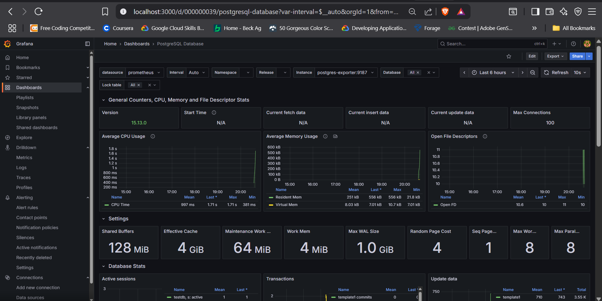

# PostgreSQL Performance Monitoring System

 *← Replace with your actual screenshot*

A real-time monitoring solution for PostgreSQL databases, leveraging Prometheus for metrics collection and Grafana for visualization. Designed to help developers and DBAs identify performance bottlenecks, slow queries, and connection issues.

## Key Features
- 📊 **Real-time metrics**: Track query latency, active connections, cache hit ratios
- ⏱ **Slow query detection**: Identify and optimize problematic queries
- 🚨 **Alerting**: Configure thresholds for critical metrics
- 🐳 **Dockerized**: Easy deployment with containerized components

## Technology Stack
- **PostgreSQL** - Database being monitored
- **Prometheus** - Metrics collection and storage
- **Grafana** - Visualization and dashboards
- **postgres_exporter** - Prometheus metrics exporter
- **Docker** - Container orchestration

## Screenshots
| Prometheus Targets | Grafana Dashboard |
|--------------------|-------------------|
|  |  |

## Getting Started

### Prerequisites
- Docker Engine 20.10+
- Docker Compose 2.0+
- 4GB RAM available

### Installation
1. Clone the repository:
   ```bash
   git clone https://github.com/yourusername/postgresql-monitoring.git
   cd postgresql-monitoring
   ```

2. Start the services:
   ```bash
   docker-compose up -d
   ```

3. Access the services:
   - Grafana: http://localhost:3000 (admin/admin)
   - Prometheus: http://localhost:9090
   - PostgreSQL: `psql -h localhost -U postgres -d testdb`

### Configuration
To customize the monitoring:
1. Edit `prometheus/prometheus.yml` for scrape intervals
2. Modify `grafana/provisioning/dashboards/dashboard.json` for custom panels
3. Adjust alert thresholds in Grafana UI

## Included Dashboards
1. **PostgreSQL Overview** (ID: 9628)
   - Query throughput
   - Connection pool health
   - Replication status

2. **Query Performance**
   - Slowest queries
   - Index usage efficiency
   - Lock contention

## Troubleshooting
```bash
# Check container logs:
docker-compose logs postgres
docker-compose logs prometheus

# Verify metrics are being collected:
curl http://localhost:9187/metrics | grep pg_stat

# Reset the environment:
docker-compose down -v
```
THANKYOU
